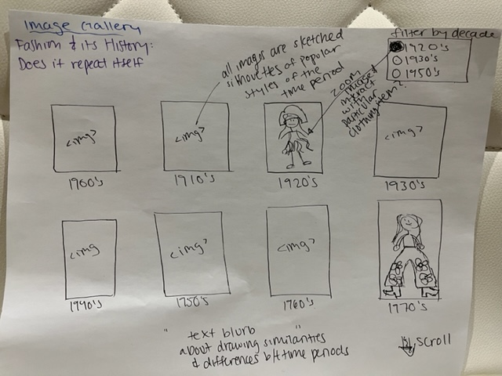
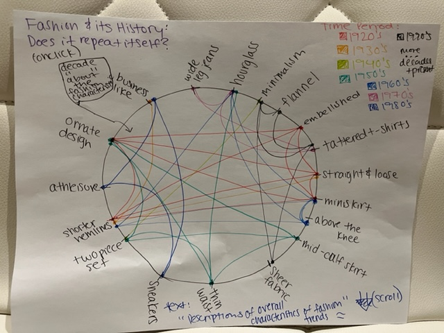
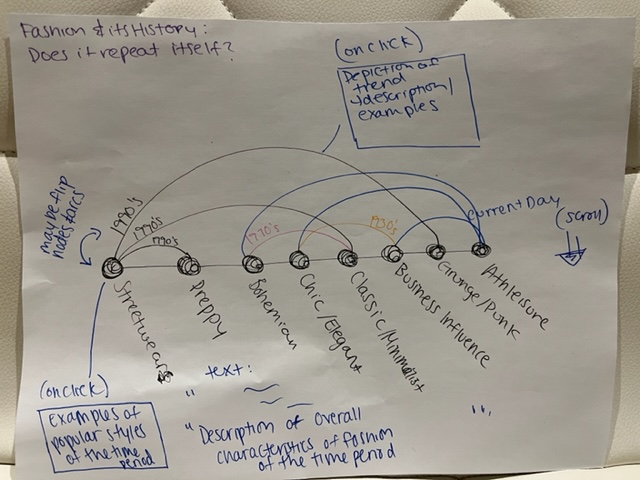

# Exercise 4- Form

## Here are a few initial sketches of what I envision my Major Studio 2 Thesis Work visual piece becoming. 

I envision my final piece to consist of several different visualizations and have a scrollytelling element
that walks the user of the webpage through different conclusions regarding the emergence of a pattern
in the history of fashion trends.

I hope to start the user experience by showing an image gallery of roughly sketched silhouettes that portray
the fashion trend or popular styles of the time period. The user would have the ability to either filter on 
time period and view fashion trends or interact with the images themselves and see characteristics of the clothing
the silhouette is dressed in.

Image Gallery Vis</img>

The user would then be able to scroll and interact with a chord like diagram that would highlight the similarities in trends
between different time periods by linking different characteristics of styles that were popular during both time periods.
The on-click on either various nodes or links would give a user further description of the decade, potential societal occurrences influencing fashion, 
and more detail regarding the clothing characteristics.

Chord-like Vis </img>

 The user would then scroll and read a blurb describing the diagram in detail as well as some patterns in fashion trends
and then view another visualization that shows the linkages between different broader style categories and decades during which they were
popular. The on click description could then also portray characteristics or certain historical events that could connect
the two time periods or broader style categories (pending additional research on how the chart will be structured).

Arc-like Vis </img>